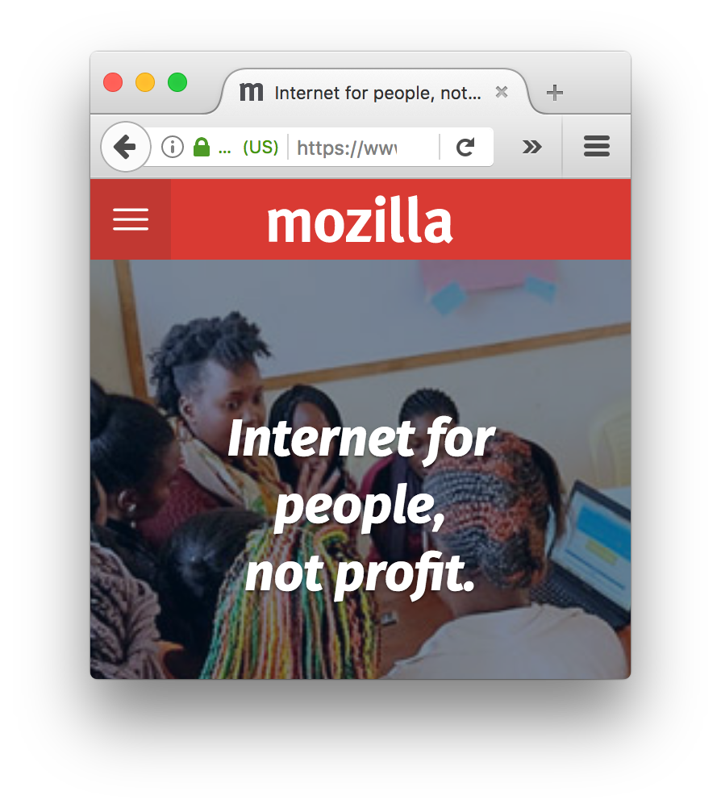
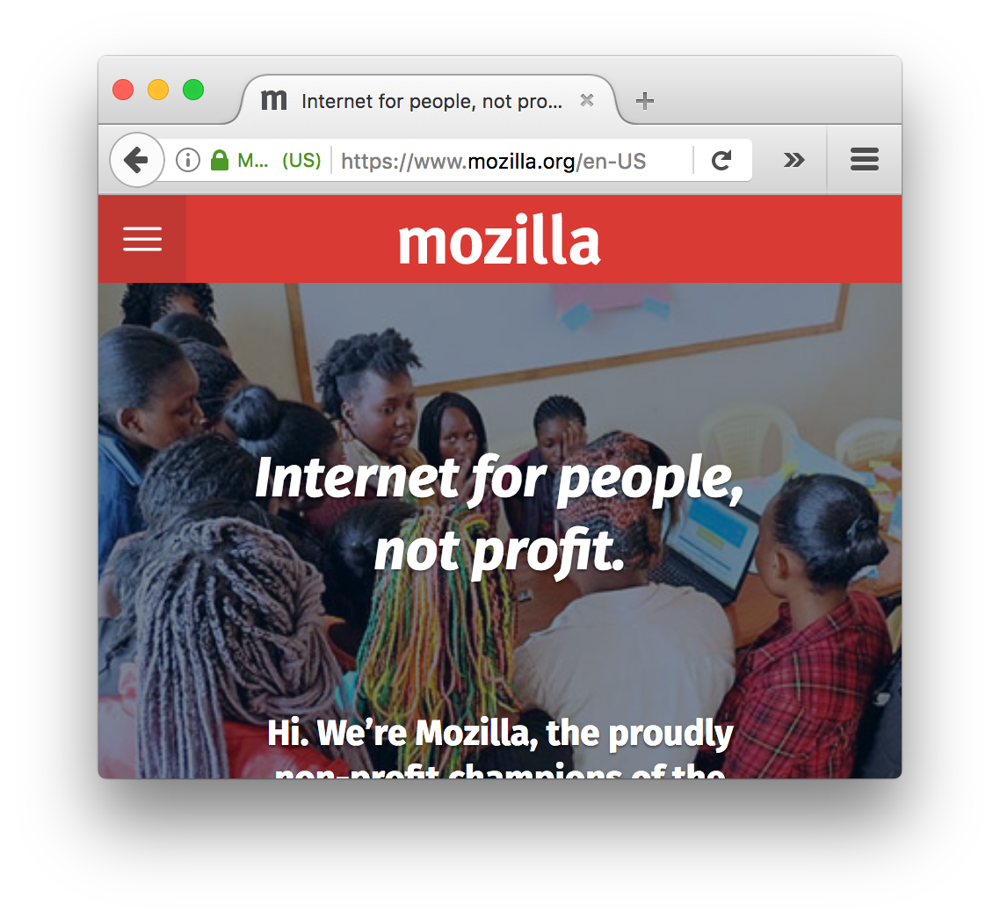
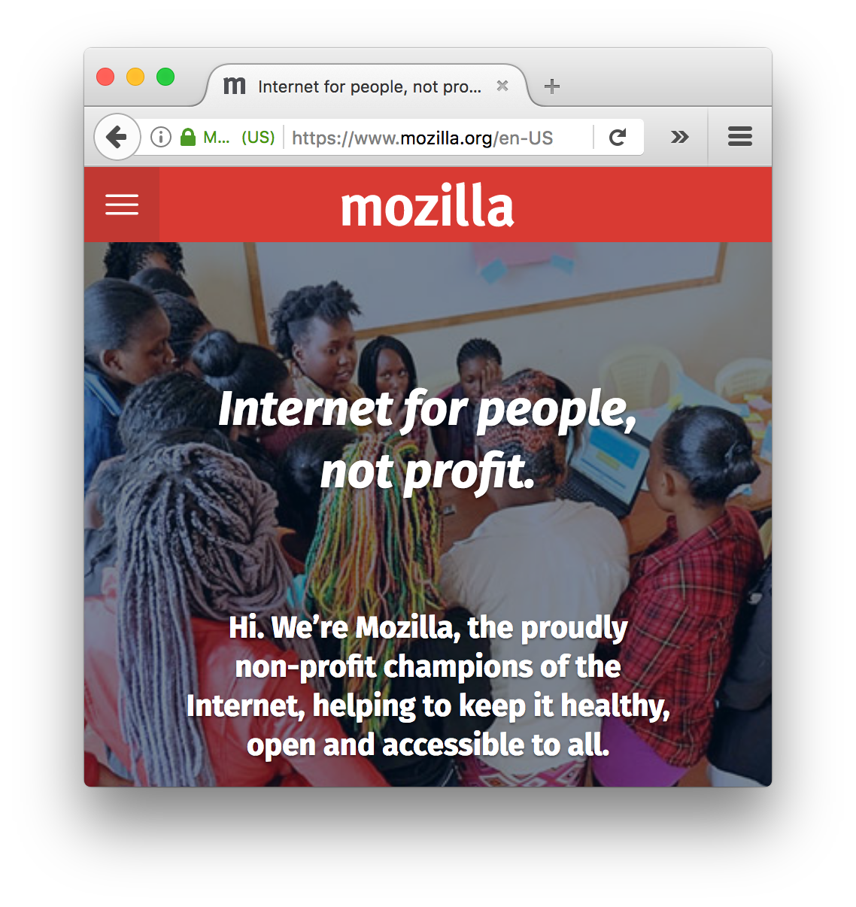

# Making demos: a quite possibly incomplete guide

The general rule: **demos should be short and self-explanatory.**

If your screenshot/video/gif needs an explanation, either the feature is not obvious or the demo needs work.

Save people's time. Get straight to the point!

## Script for a demo

The best way to save other people's time is to put in plenty of yours writing a script for your demo.

You don't need to get over-the-top creative. Write a script that answers these questions:

a) What is the name of the new feature and its purpose?
b) How to access it?
c) What is the outcome of using the feature? (and where appropriate: how do settings affect the output of the feature?)

For example, the answers for demoing a hypothetical 'tool that takes screenshots' could be:

a) Screenshot tool, to capture screenshots of the current website.
b) Enable tool in settings. Then click on the icon that represents a camera to capture the current website.
c) A capture of the contents of the current tab is captured and downloaded to the user's computer. The image file is placed on the user's `Downloads` folder (or equivalent).

Now that you've thought of this rough script, try to go through the demo steps yourself, to make sure you're not overlooking any step. They might seem obvious to you as developer of the tool, but users cannot read your brain.

Some features can be illustrated with a screenshot. Others, specially if they involve things that happen in a series of steps, tend to be better illustrated with a video. This depends on each case. At the bare minimum, try to provide a screenshot.

## General rules

If you desktop is going to be shown in the demo, make sure you remove all the clutter from it, and possibly also change to a plain, neutral colour for the background.

When capturing images, try as much as possible to show only the bits of the browser that are relevant to the feature. We normally don't need to see the contents of your desktop, or the names of your bookmarks, or any possible browser extension you might have installed. All these are distracting away from the feature you want to talk about.

Set up a new browser profile for demos. This makes it harder to 'leak' your previous history in the URL bar, and ensures that your environment is closer to what a generic user will find. Note any step to activate the feature that you might have forgotten when writing the demo script: `about:config` changes, enabling panels in the devtools settings area, etc.

When you create a new browser profile, you get a 'default' look and feel and you might also get all sorts of doorhanger bars. There's a chance they can ruin your demo recording, so be prepared to dismiss them and re-capture the demo again.

A safe url to use for demos is [mozilla.org](https://mozilla.org).

It's also often good to resize the browser so it is smaller than you would normally use. If you can make it fit in an image and the text is still readable, the better. Big browser windows have lots of space between corners that don't add anything to the demo, and the text in the browser chrome is unreadable when the images are scaled down (e.g. when displayed in contexts such as twitter).

Also, smaller assets use less space in disk, and for videos it makes it easier to be under the maximum threshold for sharing in social media.

Let's look at some examples:

### Bad: window is too big

The browser chrome here is barely visible when displayed within the context of this document.

### Bad: window is too small, doesn't show the URL

The browser chrome is visible now! We can read the elements in the screenshot.

But if this was a demo about a website, it would be a failure because we don't know what we're looking at: the URL is cut out. There is a sense of missing out.

### Moderately bad: the content in the page is cut out

This is better, we can read the full URL so we know what we're looking about. But the text in the website is cut half-way. This looks bad and is distracting from the demo.

### Good

This would be a good demonstration screenshot for the website. We can read the browser chrome elements, the full URL is displayed, and the text in the website is not cut out.

It looks balanced and complete, and users can focus on the website instead of being distracted.

## Taking screenshots

Taking a screenshot depends on the operating system you're using. Normally you can either take a screenshot of the whole desktop or just parts of it. For demo purposes, the latter is best, as we've described above.

### System shortcuts

#### Mac OS

* Full screen: <kbd>⌘</kbd> + <kbd>Shift</kbd> +<kbd>3</kbd>
* Partial: <kbd>⌘</kbd> + <kbd>Shift</kbd> +<kbd>4</kbd>, then...
  * move mouse to define the area of screen to capture, *or*
  * press <kbd>SPACE</kbd>, the cursor will change to a camera, move it over the window you want to take a screenshot of and click over it (this will create a screenshot of that window with drop shadow)

#### Windows

TODO

#### Linux

TODO

### Editing screenshots

TODO:

highlighting and blurring, annotations
further editing to make image smaller etc
no text in language to make it easier for localisations

## Recording and editing videos
Screenflow, quicktime
Zooming in
Ffmpeg
Display keypresses+shortcuts and clicks

## Recording GIFs
LICEcap
ffmpeg
