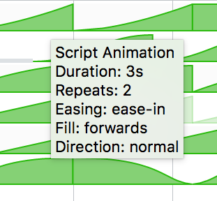

# Easing visualization in the animation inspector ([Bug 1210795](https://bugzilla.mozilla.org/show_bug.cgi?id=1210795))

The easing (or  timing function) of an animation is what dictates the way it progresses through time.

For example, a linear easing means that an animation runs at the same speed throughout its duration. This means that if an element isn't moving at first and then starts to move, it will do so instantly, as if it didn't even need to accelerate.
Often, web developers choose other easings that look more natural, more life-like. There are a few built-in ones like [ease, ease-in, ease-out and ease-in-out](https://developer.mozilla.org/en-US/docs/Web/CSS/animation-timing-function#single-timing-function) and it's even possible to create your own using the [`cubic-bezier()` function](https://developer.mozilla.org/en-US/docs/Web/CSS/single-transition-timing-function#The_cubic-bezier()_class_of_timing-functions).

It's worth noting that the inspector panel in Firefox alreay allows you to [edit animations easings in the Rules view](https://developer.mozilla.org/en-US/docs/Tools/Page_Inspector/How_to/Work_with_animations#Edit_timing_functions).

Additionally, and starting with Firefox 52, the [animation inspector panel](https://developer.mozilla.org/en-US/docs/Tools/Page_Inspector/How_to/Work_with_animations#Animation_inspector) now displays animations' easings directly within its timeline:

This is very useful to get more information about animations at a glance.

There is also a handy tooltip that appears when hovering over animations. It contains all the timing information you might need about a given animation: its easing is one of them, but also durations, iterations, delays, direction, etc.

Here are various examples of how easing is represented in the timeline:

- An animation that repeats 3 times, with an ease-in-out easing:

- An infinite animation, with linear easing:

- An animation that repeats 5 times, with an alternate direction, ease easing and forwards filling:

## About delays

There are 2 types of delays you can use in animations: delay and end-delay.

The latter can only be used with animations created using [the Web Animations API](https://developer.mozilla.org/en-US/docs/Web/API/Web_Animations_API) and is useful to synchronize several animations (say when you want your next animation to start exactly 1s after the first has ended).

Both the delay and end-delay can be positive or negative.

The animation inspector now also represents those delays visually. Here are a few examples:

- Positive delay:

- Positive end-delay:

- Negative delay:

- Negative end-delay:

## Effect easing vs. keyframe easing

There are 2 ways to apply easing to an animation: either across the whole iteration of an animation, affecting all properties alike (effect easing), or between keyframes and only affecting the properties specified on those keyframes (keyframe easing).

CSS animations only allows for keyframe easing and this confuses a lot of people. Nearly everyone assumes that [`animation-timing-function`](https://developer.mozilla.org/en-US/docs/Web/CSS/animation-timing-function) does effect easing but it does keyframe easing instead.

The [the Web Animations API](https://developer.mozilla.org/en-US/docs/Web/API/Web_Animations_API) offers both types of easing.

Right now, the animation inspector only displays effect easing.

This means that even if you defined a CSS animation with a non-linear `animation-timing-function`, the timeline will display a linear progression.

[Bug 1309468](https://bugzilla.mozilla.org/show_bug.cgi?id=1309468) will address this and make keyframe easing visible in the animation inspector too.
